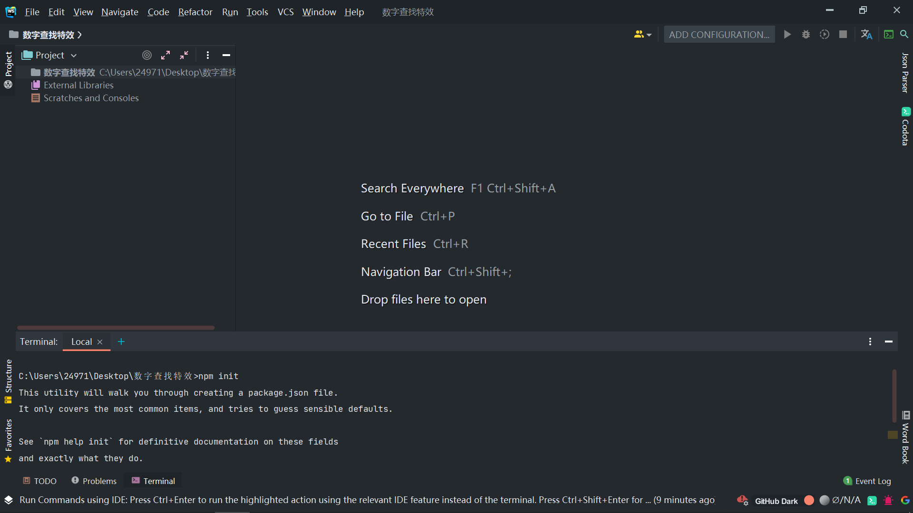
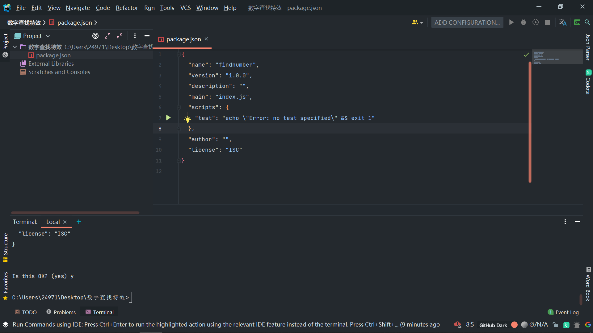
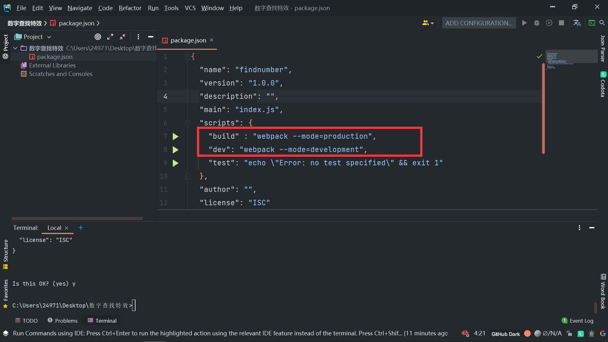
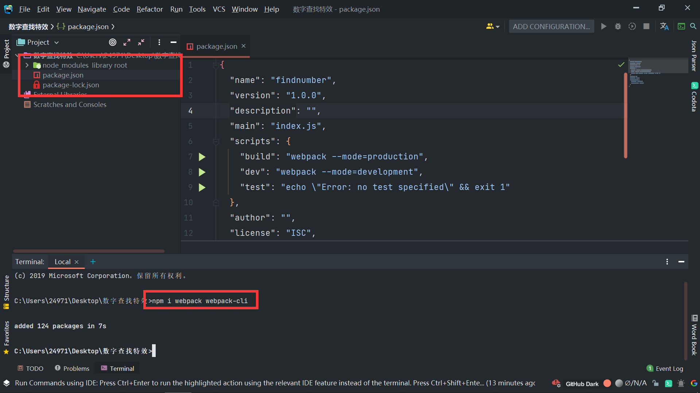
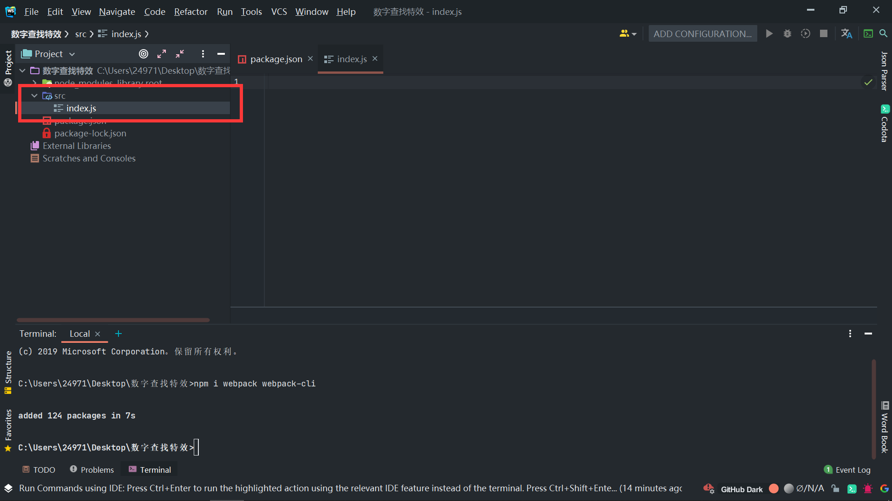
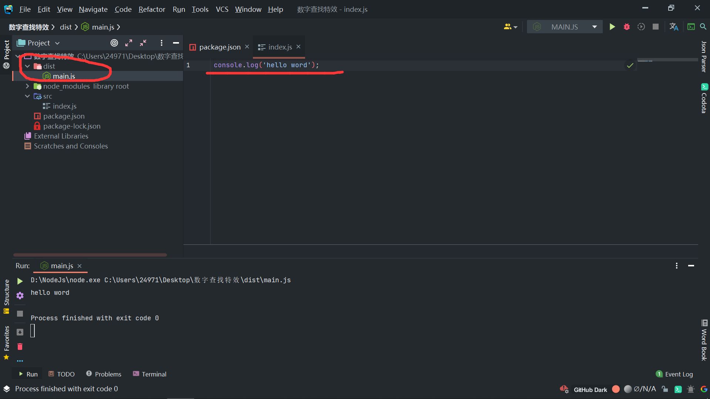

# webpack练习项目

## First
首先 先建立文件夹

使用 npm 初始化 init

之后 修改以下 script

之后再安装 webpack 和 webpack-cli

同时建立下 src 文件夹

进行一次打包测试

没有任何的问题,可以开始着手编写代码

## second

区分项目的模块

将要发布的代码 index.html 放入 dist 文件夹中 在其中引入 main.js

然后将其余的代码放入src文件夹中

### util文件夹

首先建立 util 文件夹，放入一些工具逻辑类的函数

- getNumber   用于获得数字
- isPrime     用于判断素数
- randomColor 用于获得随机数和随机颜色

### page文件夹

page文件夹中放有和页面相关的 js 文件

- appendNumber 用于将数字添加到html中
- event 用于处理将鼠标点击事件

## end

该项目主要用于练习 webpack 操作
